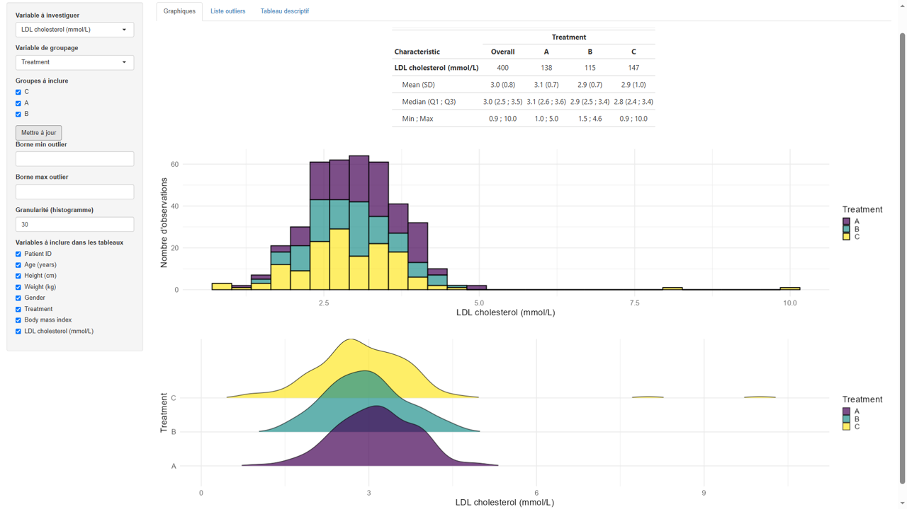
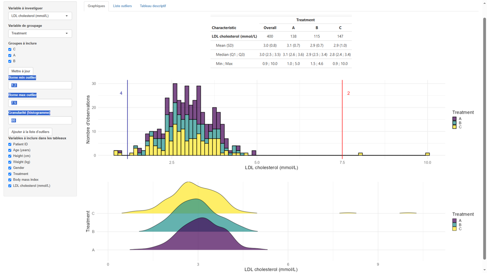
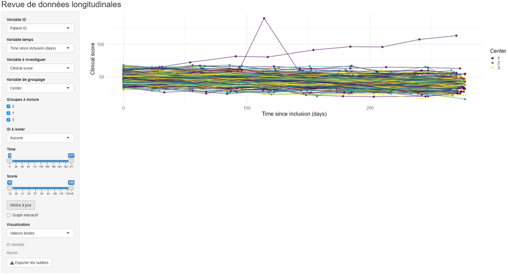
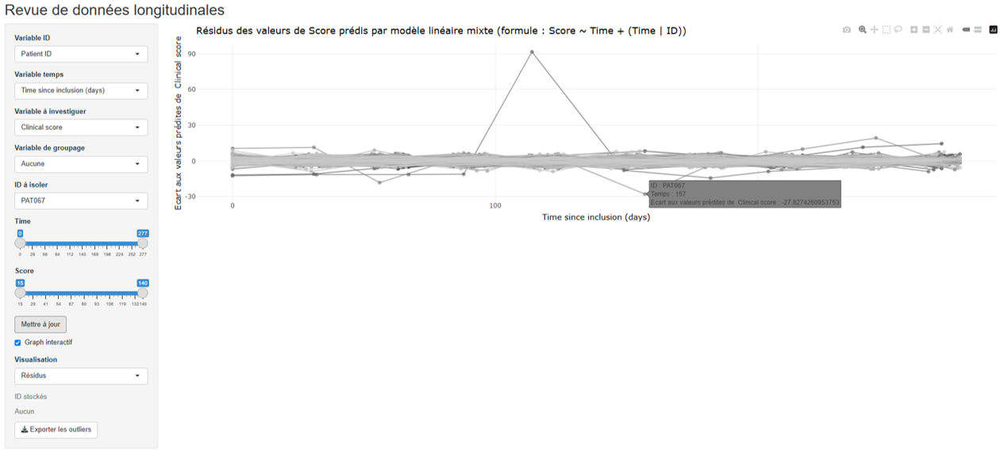

# shinyrdd

**Dynamic graphical tools for quantitative and longitudinal data review using R and Shiny.**

Before statistical analysis, a careful review of the data is essential to identify unexpected observations, unusual distributions, extreme values, or atypical individual trajectories.

`shinyrdd` provides interactive tools to support this process for both **quantitative** and **longitudinal data**. The package is designed to help users explore their data iteratively, investigate potentially unusual observations, and document observations requiring further review.

> **`shinyrdd` does not automatically classify observations as outliers.**
> It provides an interactive framework to support the reviewer's judgement and facilitate the documentation of observations requiring further investigation.

---

## Features

`shinyrdd` provides two interactive Shiny applications and three standalone plotting functions.

### Quantitative data review

[`shiny_Qrev()`](#shiny_qrev) allows users to:

* explore the distribution of quantitative variables;
* stratify distributions according to qualitative variables;
* adjust histogram binning;
* define minimum and maximum boundaries;
* identify observations outside predefined limits;
* review potentially unusual observations;
* progressively build a list of observations requiring further investigation;
* export reviewed observations to Excel.

### Longitudinal data review

[`shiny_Lrev()`](#shiny_lrev) allows users to:

* explore individual trajectories over time;
* compare trajectories across groups;
* filter observations by group or individual;
* interactively investigate individual observations;
* isolate individual trajectories;
* visualise residuals from a linear mixed-effects model;
* build a list of observations requiring further investigation;
* export reviewed observations to Excel.

### Standalone plotting functions

The graphical components of the applications are also available as independent functions:

* [`hist_Qrev()`](#hist_qrev) — histograms for quantitative data;
* [`ridges_Qrev()`](#ridges_qrev) — ridgeline density plots;
* [`spag_Lrev()`](#spag_lrev) — spaghetti plots for longitudinal data.

These functions are particularly useful when a similar figure needs to be reproduced for a report or publication.

---

# Installation

## Development version from GitHub

The development version can be installed directly from GitHub:

```r
install.packages("remotes")
remotes::install_github(
  "romancreuse/shinyrdd",
  build_vignettes = TRUE
)
```

Then load the package:

```r
library(shinyrdd)
```

The vignette can be accessed with:

```r
browseVignettes("shinyrdd")
```

or:

```r
vignette("introduction-shinyrdd", package = "shinyrdd")
```

> **Note:** `build_vignettes = TRUE` is required when installing the package from GitHub with `remotes::install_github()` if you want the vignette to be built and installed locally.

---

# Getting started

The package includes two synthetic datasets that can be used to explore its functionality:

* `quanti_demo` — example quantitative data;
* `longi_demo` — example longitudinal data.

```r
data(quanti_demo)
data(longi_demo)
```

---

# Quantitative data review

## `shiny_Qrev()`

`shiny_Qrev()` launches an interactive application for reviewing quantitative data.

The application expects data in **wide format**, with one row per individual.

```r
shiny_Qrev(
  df = quanti_demo,
  qual_conv = c("Gender"),
  ID = "ID"
)
```

The `qual_conv` argument can be used when qualitative variables are stored as numeric values and need to be converted to factors.

The `ID` argument specifies the variable containing individual identifiers.

### Main features

The application provides:

1. Selection of the quantitative variable to review.
2. Optional selection of a grouping variable.
3. Selection of the group levels to include.
4. Descriptive statistics.
5. Histograms.
6. Ridgeline density plots when a grouping variable is selected.
7. Adjustable histogram binning.
8. Optional minimum and maximum review boundaries.
9. Identification of observations outside these boundaries.
10. A dedicated page for reviewing potentially unusual observations.
11. An observation review list.
12. Excel export of reviewed observations.

### Example

```r
shiny_Qrev(
  df = quanti_demo,
  qual_conv = c("Gender"),
  ID = "ID"
)
```

### Application overview



### Investigating potential outliers



---

# Longitudinal data review

## `shiny_Lrev()`

`shiny_Lrev()` launches an interactive application for reviewing longitudinal or repeated-measures data.

The application expects data in **long format**, with one row per observation.

```r
shiny_Lrev(
  df = longi_demo,
  qual_conv = c("Gender", "Treatment")
)
```

### Main features

The application allows users to:

1. Select the quantitative variable to review.
2. Select the time variable.
3. Select the individual identifier.
4. Define qualitative grouping variables.
5. Filter observations by group.
6. Investigate individual trajectories.
7. Select individuals directly from the interactive graph.
8. Isolate individual trajectories.
9. Visualise model residuals.
10. Build a list of observations requiring further investigation.
11. Export reviewed observations to Excel.

### Spaghetti plots

Individual trajectories can be visualised using spaghetti plots, making it easier to identify unusual patterns of evolution over time.



### Model residuals

`shiny_Lrev()` can also display residuals from a linear mixed-effects model. This provides a complementary way of investigating observations that differ substantially from the values expected under the fitted longitudinal model.



---

# Standalone plotting functions

The plotting functions can be used independently of the Shiny applications.

## `hist_Qrev()`

`hist_Qrev()` creates histograms for quantitative variables.

A grouping variable can optionally be specified, and minimum and maximum review boundaries can be displayed.

```r
hist_Qrev(
  df = quanti_demo,
  x = "LDL",
  group = "Treatment",
  bmin = 1.2,
  bmax = 7.5,
  bins = 80
)
```


See:

```r
?hist_Qrev
```

for further information.

---

## `ridges_Qrev()`

`ridges_Qrev()` creates ridgeline density plots to compare quantitative distributions across groups.

```r
ridges_Qrev(
  df = quanti_demo,
  x = "LDL",
  group = "Treatment"
)
```


See:

```r
?ridges_Qrev
```

for further information.

---

## `spag_Lrev()`

`spag_Lrev()` creates spaghetti plots for longitudinal data.

```r
spag_Lrev(
  df = longi_demo,
  x = "Score",
  time = "Time",
  ID = "ID"
)
```


See:

```r
?spag_Lrev
```

for further information.

---

# Data review workflow

A typical workflow with `shinyrdd` can be summarised as:

```text
                    Raw data
                       │
                       ▼
             ┌──────────────────┐
             │   Explore data   │
             └────────┬─────────┘
                      │
             ┌────────▼─────────┐
             │ Visualise        │
             │ distributions /  │
             │ trajectories     │
             └────────┬─────────┘
                      │
             ┌────────▼─────────┐
             │ Identify         │
             │ potentially      │
             │ unusual data     │
             └────────┬─────────┘
                      │
             ┌────────▼─────────┐
             │ Investigate      │
             │ observations     │
             └────────┬─────────┘
                      │
             ┌────────▼─────────┐
             │ Document /       │
             │ export           │
             └────────┬─────────┘
                      │
                      ▼
               Statistical
                  analysis
```

The review criteria can be adjusted throughout this process as the characteristics of the data become better understood.

---

# Documentation

A complete introduction to the package is available in the vignette:

```r
vignette("introduction-shinyrdd", package = "shinyrdd")
```

The documentation for individual functions is available through:

```r
?shiny_Qrev
?shiny_Lrev

?hist_Qrev
?ridges_Qrev
?spag_Lrev
```

---

# Demo datasets

The package provides two synthetic datasets for demonstration purposes.

### `quanti_demo`

A quantitative dataset containing individual-level observations and several quantitative and qualitative variables.

```r
data(quanti_demo)
```

### `longi_demo`

A longitudinal dataset containing repeated observations for multiple individuals.

```r
data(longi_demo)
```

These datasets are intended for demonstration and testing of the package functionality.

---

# Design philosophy

The identification of potentially unusual observations is often context-dependent. A value that appears extreme in one population may be entirely plausible in another, and unusual longitudinal trajectories may require investigation in light of the study design and expected biological or clinical behaviour.

`shinyrdd` therefore follows an **interactive and exploratory approach** rather than attempting to provide an automated outlier-detection algorithm.

The package is intended to help users:

* explore their data visually;
* define and adjust review criteria;
* investigate potentially unusual observations;
* document observations requiring further review;
* preserve the original dataset;
* prepare observations for further investigation before statistical analysis.

---

# Future developments

Future versions of `shinyrdd` may include additional functionality, including:

* French and English user interfaces;
* additional graphical tools for data review;
* enhanced review and annotation capabilities;
* additional methods for longitudinal data exploration.

---

# Author

**Roman Creuse**

`shinyrdd` is developed and maintained by Roman Creuse.

---

# License

`shinyrdd` is released under the MIT License.

See the `LICENSE` file for details.
