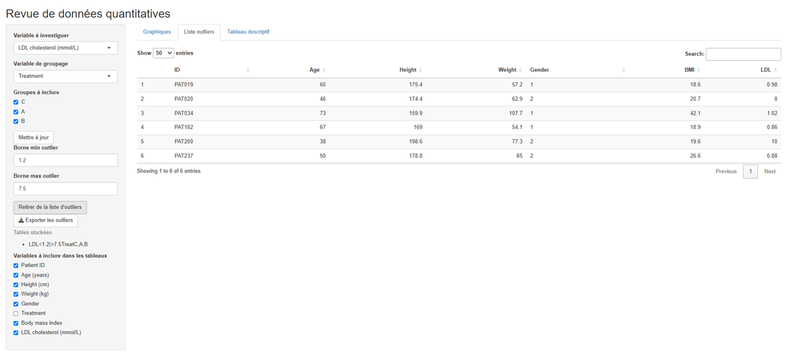
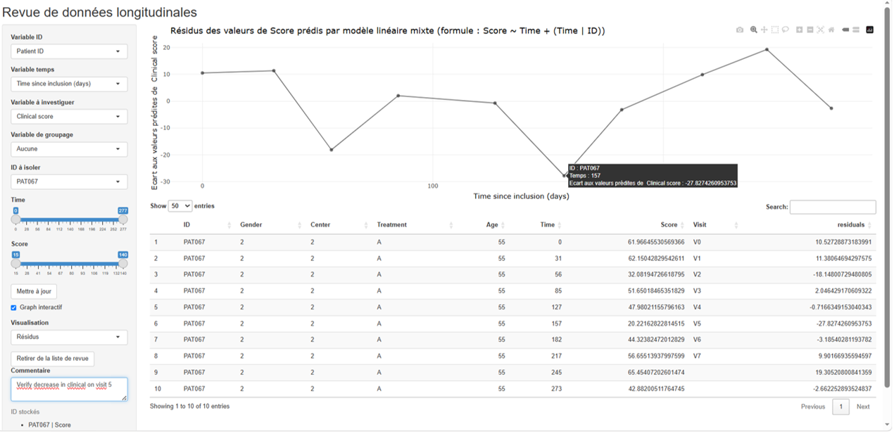

```{r, include = FALSE}
knitr::opts_chunk$set(
  collapse = TRUE,
  comment = "#>"
)
```

```{r setup}
library(shinyrdd)
```

Before any statistical analysis, a careful review of the data is an essential step. The presence of outliers or unexpected observations can influence statistical results and potentially lead to misleading conclusions. For both quantitative and longitudinal or repeated-measures data, usual descriptive statistics may sometimes fail to reveal certain atypical observations. Graphical representations therefore provide a valuable complement, making it easier to identify unusual distributions, extreme values, or atypical individual trajectories.

However, what constitutes an aberrant observation is not always known a priori. It may depend on the context, the characteristics of the study population, and the observations encountered during the data review. The criteria used to identify potentially problematic observations may therefore evolve throughout the review process. An effective data review should consequently be flexible and allow these criteria to be adjusted iteratively as new features of the data are identified.

`shinyrdd` was developed with this objective in mind. It provides dynamic graphical tools for reviewing quantitative and longitudinal data, allowing users to adjust the parameters most relevant to the identification of atypical observations, explore individuals whose data may require further investigation, and compile lists of observations requiring verification before statistical analysis.

# `shiny_Qrev()` : A shiny application to review quantitative data

The first tool provided by `shinyrdd` is `shiny_Qrev()`, a Shiny application designed to facilitate the review of quantitative data.  
  
The function requires a data frame containing the data to be reviewed in wide format, with one row per individual. Two optional arguments can be used to specify the ID variable of the data frame and a character vector containing the names of variables that should be converted to factors before launching the application. This conversion is useful when qualitative variables are stored as numeric values, as numeric variables are not available as grouping variables in the application. The ID variable is excluded from the list of possible grouping variables and from the descriptive tables to reduce rendering time.  

## Launching the application  
   
To launch the application, provide the data frame and, if needed, the optional arguments:  
  
```{r, eval=FALSE}
shiny_Qrev(
  df = quanti_demo,
  qual_conv = c("Gender"),
  ID = "ID"
)  

```
  
## Selecting variables and groups  
  
The application allows users to select the variable to be reviewed (Variable à investiguer), whether the data should be described by group (Variable de groupage) and, if a grouping variable is selected, which levels should be included in the review (Groupes à inclure).  

These three parameters, located above the update (Mettre à jour) button, are only applied when the button is clicked. This prevents the application from unnecessarily recomputing the outputs while the parameters are being changed and therefore reduces loading times.  
  
## Exploring quantitative distributions  
  
The main page of the application displays a descriptive table for the selected variable, a histogram and, when a grouping variable is selected, density ridges.  
  
```{r fig1Qrev, echo=FALSE, out.width="100%"}
knitr::include_graphics("figures/shiny_Qrev1.png")
```  
  
The graphical parameters below the Mettre à jour button can be used to adjust the visualisation:  
  
The number of bins in the histogram can be modified to reveal more or less detailed features of the distribution.
Minimum and maximum boundaries can be defined to display their position on the histogram and the number of individuals with values outside these boundaries.  
  
These parameters can be adjusted iteratively during the review to investigate different aspects of the distribution.  
  
```{r fig2Qrev, echo=FALSE, out.width="100%"}
knitr::include_graphics("figures/shiny_Qrev2.png")
```  
  

## Reviewing potential outliers  
  
When observations fall outside the defined boundaries, their data can be reviewed in the Liste d'outliers page.  
  
The variables to be displayed in this table can be selected using the checkboxes. These are also the variables that will be included in the exported tables.  
  
Once potentially unusual observations have been identified, they can be added to the review list using the Ajouter à la liste d'outliers button. This allows observations to be collected progressively during the review without modifying the original dataset. 
  
```{r fig3Qrev, echo=FALSE, out.width="100%"}

```  
  
## Exporting observations  
  
Once the data review is complete, all observations stored in the review list can be exported to an Excel file using the export (Exporter les outliers) button.  
  
Each stored table is saved in a separate worksheet of the resulting Excel file, allowing the observations identified during the review to be further investigated before statistical analysis.   
  
# `shiny_Lrev()`: A Shiny application for reviewing longitudinal data

The second tool provided by `shinyrdd` is `shiny_Lrev()`, a Shiny application designed to facilitate the review of longitudinal or repeated-measures data.

The function requires a data frame containing the longitudinal data, with one row per observation and one or more observations per individual. An optional argument allows users to specify a character vector containing the names of qualitative variables that should be converted to factors before launching the application. This can be useful when categorical variables are stored in another format.  
## Launching the application  
  
To launch the application, provide the data frame and, if needed, the variables to be converted to factors:  

```{r, eval=FALSE}
  
shiny_Lrev(
  df = longi_demo,
  qual_conv = c("Gender", "Treatment")
)  

```
  
## Selecting variables and groups  
  
The application allows users to select the quantitative variable to be reviewed, the time variable, and the individual identifier. Qualitative variables can be used to define groups and to compare individual trajectories across different levels of a grouping variable.  
  
The review can also be restricted to selected groups or to a specific individual. This makes it possible to progressively move from an overall view of the longitudinal data to a more detailed review of individual trajectories.  
  
## Exploring individual trajectories  
  
The main page of the application displays individual trajectories over time using a spaghetti plot. When a grouping variable is selected, trajectories can be distinguished according to group.  
  
This graphical representation makes it possible to identify unusual trajectories, isolated measurements, or individuals whose evolution over time differs from the general pattern.  
  
```{r fig1Lrev, echo=FALSE, out.width="100%"}
knitr::include_graphics("figures/shiny_Lrev1.png")
```  
  
The different filtering options can be used to focus the review on selected groups or individuals. An individual can also be selected directly from the graphical representation, allowing the corresponding trajectory to be investigated in more detail and their data to be displayed.  
  
The graph can also be made interactive using the dedicated checkbox (Graph interactif). This allows users to display information about specific observations and to select an individual's ID to isolate their trajectory. However, interactive plotting significantly increases plotting time. We therefore recommend enabling this option only once a trajectory requiring further investigation has been identified.  
  
## Reviewing model residuals  
  
In addition to the raw measurements, `shiny_Lrev()` allows users to visualise residuals from a linear mixed-effects model.  
  
This representation can be useful for identifying observations or individuals whose measurements differ substantially from the values expected from the fitted longitudinal model. The residual-based view provides a complementary approach to the visual inspection of raw trajectories and can help identify observations that may require further investigation. 
  
```{r fig2Lrev, echo=FALSE, out.width="100%"}
knitr::include_graphics("figures/shiny_Lrev2.png")
```  
  
## Reviewing and exporting observations
  
As in the quantitative data review application, potentially unusual observations can be added to a review list during the data review process.  
  
The observations to be reviewed can be selected and stored without modifying the original dataset. Once the review is complete, the stored observations can be exported to an Excel file for further investigation before statistical analysis.  
  
```{r fig3Lrev, echo=FALSE, out.width="100%"}

```  
  
# Reproduce your `shinyrdd` graphs for reporting

All `shinyrdd` graphs are created using ggplot2. If substantial modifications are required, we recommend creating the graph directly with `ggplot2`. However, if you want to quickly reproduce a similar graph with only minor modifications, you can use the plotting functions provided by `shinyrdd`.  

## Plot histograms with `hist_Qrev()`  
  
```{r hist_Qrev, echo=TRUE,fig.width=9, fig.height=5, out.width="100%"}
hist_Qrev(
  df = quanti_demo,
  x = "LDL",
  group = "Treatment",
  bmin = 1.2,
  bmax = 7.5,
  bins = 80
)
```  
  
See `?hist_Qrev` for further information.
  
## Plotting ridgeline densities with `ridges_Qrev()`

```{r ridges_Qrev, echo=TRUE,fig.width=9, fig.height=5, out.width="100%"}
ridges_Qrev(
  df = quanti_demo,
  x = "LDL",
  group = "Treatment"
)
```  
  
See `?ridges_Qrev` for further information.   
  
## Plotting spaghetti plots with `spag_Lrev()`

```{r spag_Lrev, echo=TRUE,fig.width=9, fig.height=5, out.width="100%"}
spag_Lrev(
  df = longi_demo,
  x = "Score",
  time = "Time",
  ID = "ID"
)

``` 
  
See `?spag_Lrev` for further information. 
